# MODELO DE DADOS — Sistema Legado de Estoque/PDV (dBase/Clipper)

Documento gerado a partir da conversão dos arquivos `.DBF` (dBase III / Clipper)
encontrados em `data/ESTOQUE/`. Os arquivos foram convertidos para CSV em
`data/csv/` pelo script `data/dbf2csv.py` (parser pure-Python, sem dependências,
decodificação `cp850`).

> **Natureza do sistema:** ERP/PDV de varejo (loja de materiais de construção).
> Núcleo composto por **cadastros** (produtos, clientes, fornecedores, vendedores),
> **movimento de vendas/orçamentos**, **movimento de estoque**, **financeiro**
> (caixa, contas a pagar/receber, cheques) e **tabelas auxiliares/fiscais**.

## Como a conversão foi feita

```bash
cd data
python3 dbf2csv.py            # converte todos os .DBF -> data/csv/*.csv + _schema.json
python3 dbf2csv.py "ESTOQUE.DBF"   # converte um arquivo específico
```

- Registros marcados como deletados (`*`) são ignorados.
- Datas `D` viram `YYYY-MM-DD`; lógicos `L` viram `true`/`false`.
- O schema completo de **todos** os 160 arquivos fica em `data/csv/_schema.json`.

## Observações importantes sobre os arquivos

- **Tabelas `TMP*` (~110 arquivos):** arquivos temporários gerados em runtime pelo
  sistema legado (relatórios/seleções). **Não fazem parte do modelo** e devem ser
  descartados na migração.
- **Tabelas `X*` (ex. `XLIENTES`, `XSTOQUE`, `XOVEST`, `XOTAS`):** cópias de
  backup/versões antigas das tabelas correspondentes (`CLIENTES`, `ESTOQUE`,
  `MOVEST`, `NOTAS`). **Não fazem parte do modelo.**
- **`ncm.dbf` (17.668 regs):** tabela de domínio fiscal (códigos NCM), referência
  estática nacional.
- Muitas tabelas estão **vazias** (0 registros) nesta extração — refletem
  funcionalidades do ERP não usadas nesta instalação, mas a estrutura é válida.

---

## Tabelas do núcleo

### Cadastros

#### ESTOQUE — Produtos (catálogo + estoque)
Tabela central de produtos. PK lógica: `CODIGO`.

| Campo | Tipo | Descrição |
|---|---|---|
| CODIGO | N(13) | **PK** — código do produto |
| BARRAS | N(13) | código de barras (EAN) |
| GRUPO | N(4) | **FK** → GRUPOS.NUMERO |
| SUBGRUPO | N(4) | **FK** → SUBGRUPO.NUMERO |
| PRODUTO | C(35) | descrição do produto |
| RESUMO | C(15) | descrição abreviada (cupom) |
| APLICACAO | C(35) | aplicação/uso |
| LOCAL | C(10) | localização física |
| FABRICANTE | C(15) | fabricante |
| CODFABRICA | C(12) | código do fabricante |
| UNIDADE | C(5) | unidade de venda |
| ESTOQUE | N(15,3) | saldo em estoque |
| MINIMO | N(6) | estoque mínimo |
| CUSTO | N(15,3) | custo |
| VENDA1/2/3 | N(12,3) | preços de venda (3 tabelas) |
| FATOR1/2/3 | N(12,3) | fatores/markup |
| ULTCOMPRA | D | data da última compra |
| ULTFORNECE | N(4) | **FK** → FORNECE.NUMERO (último fornecedor) |
| ULTQUANT | N(10) | última quantidade comprada |
| NCM | C(8) | **FK** → NCM.NCM |
| CST / CSOSN | C(3) | situação tributária |
| CFOP | C(4) | **FK** → CFOP.CFOP |
| IPI / ALIQUOTA / COMISSAO | N | tributos e comissão |
| COMPOSTO | C(1) | indica produto composto (kit) → COMPO |
| ... | | (46 campos no total — ver `_schema.json`) |

#### CLIENTES — Clientes
PK lógica: `NUMERO`.

| Campo | Tipo | Descrição |
|---|---|---|
| NUMERO | N(6) | **PK** — código do cliente |
| NOME | C(50) | razão social / nome |
| FANTASIA | C(35) | nome fantasia |
| CPF | C(14) | CPF/CNPJ |
| PESSOA | C(1) | F (física) / J (jurídica) |
| ENDERECO, BAIRRO, CIDADE, ESTADO, CEP | C | endereço |
| CODMUNIC | C(7) | **FK** → CIDADES.MUNIC (cód. IBGE município) |
| TELEFONES, FAX, EMAIL | C | contatos |
| TOTAL, SALDO, LIMITE | N(15,2) | financeiro do cliente |
| STATUS, CATEG, DIAVENC | N | classificação / crédito |
| ... | | (34 campos — ver `_schema.json`) |

#### FORNECE — Fornecedores
PK lógica: `NUMERO`. Campos: NOME, RAZAO, CGC, INSC, endereço,
`CODMUNIC` (**FK** → CIDADES.MUNIC), contatos. (16 campos)

#### VENDEDOR — Vendedores
PK lógica: `CODIGO`. Campos: NOME, dados pessoais, COMISSAO, TOTAL acumulado,
`USUARIO` (**FK** → USUARIOS.NUMERO). (22 campos)

#### USUARIOS — Operadores do sistema
PK lógica: `NUMERO`. Campos: NOME, ACESSOS (permissões), SENHA.

### Domínios / classificação

#### GRUPOS — Grupos de produto
`NUMERO` (**PK**), `NOME`.

#### SUBGRUPO — Subgrupos de produto
`NUMERO` (**PK**), `NOME`.

#### NCM — Nomenclatura Comum do Mercosul (domínio fiscal)
`NCM` (**PK**, C8), `DESCRICAO`. 17.668 registros (referência nacional).

#### CFOP — Códigos Fiscais de Operação
`CFOP` (**PK**, C5), `NATOPER`, `TIPO`.

#### CIDADES — Municípios (IBGE)
`MUNIC` (**PK**, cód. IBGE), `NOMEMUNIC`, `UF`, `NOMEUF`, `CUF`.

#### CENTROS — Centros de custo
`CENTRO` (**PK**), `NOME`, `TIPO`.

#### CONTAS — Plano de contas
`CONTA` (**PK**), `DESCRICAO`.

#### PGTO — Formas de pagamento
`CODIGO` (**PK**), `DESCRICAO`, regras de parcelamento (VENC1..6, MERC1..6),
`CENTRO` (**FK** → CENTROS.CENTRO).

### Vendas / Orçamentos (movimento)

#### NOTAS — Cabeçalho de vendas/pedidos
Documento de venda. PK lógica: `CONTROLE`.

| Campo | Tipo | Descrição |
|---|---|---|
| CONTROLE | N(8) | **PK** — nº de controle interno do documento |
| DOCUMENTO | N(8) | nº do documento/cupom |
| OPERACAO | N(1) | tipo de operação |
| CLIENTE | N(6) | **FK** → CLIENTES.NUMERO |
| VENDEDOR | N(3) | **FK** → VENDEDOR.CODIGO |
| USUARIO | N(3) | **FK** → USUARIOS.NUMERO |
| FORMAPGTO | N(2) | **FK** → PGTO.CODIGO |
| CFOP | C(5) | **FK** → CFOP.CFOP |
| DATA, HORA | D/C | data/hora |
| TOTAL, VALDESC, FRETE, VALPAGO | N(15,2) | valores |
| ENTREGADOR | N(3) | **FK** → VENDEDOR.CODIGO (entregador) |
| ... | | (23 campos) |

#### ITENS — Itens das vendas/notas
Detalhe de NOTAS. Sem PK própria; chave composta lógica (`CONTROLE`, `PRODUTO`).

| Campo | Tipo | Descrição |
|---|---|---|
| CONTROLE | N(8) | **FK** → NOTAS.CONTROLE |
| PRODUTO | N(13) | **FK** → ESTOQUE.CODIGO |
| UNITARIO | N(15,3) | preço unitário (snapshot na venda) |
| QUANTIDADE | N(15,3) | quantidade |
| CUSTO | N(15,3) | custo no momento |

#### ORCAM — Cabeçalho de orçamentos/pedidos
PK lógica: `CONTROLE`. FKs: `CLIENTE` → CLIENTES, `VENDEDOR` → VENDEDOR,
`FORMAPGTO` → PGTO. Campos: PEDIDO, DATA, TOTAL, VALDESC, ADIANTA, ENTREGAR. (15 campos)

#### ITEMORC — Itens dos orçamentos
Detalhe de ORCAM. FK `CONTROLE` → ORCAM.CONTROLE, `PRODUTO` → ESTOQUE.CODIGO.
Campos: UNITARIO, QUANTIDADE.

#### CANCELA — Itens cancelados (PDV)
Log de cancelamentos. FK `PRODUTO` → ESTOQUE.CODIGO, `USUARIO` → USUARIOS.NUMERO.
Campos: DATA, HORA, UNITARIO, QUANTIDADE.

### Estoque (movimento)

#### MOVEST — Movimentação de estoque
PK lógica composta (transação). FKs: `PRODUTO` → ESTOQUE.CODIGO,
`VENDEDOR` → VENDEDOR.CODIGO, `USUARIO` → USUARIOS.NUMERO,
`CONTROLE` → NOTAS.CONTROLE (quando originada de venda).

| Campo | Tipo | Descrição |
|---|---|---|
| DATA, HORA | D/C | momento |
| PRODUTO | N(13) | **FK** → ESTOQUE.CODIGO |
| CODIGO | N(2) | tipo de movimento (entrada/saída/ajuste) |
| QUANTIDADE | N(15,3) | quantidade movimentada |
| SALDO | N(15,3) | saldo resultante |
| UNITARIO | N(15,3) | valor unitário |
| CONTROLE | N(8) | **FK** → NOTAS.CONTROLE |

#### COMPO — Composição de produtos (kits)
`CODIGO` (**FK** → ESTOQUE.CODIGO, produto pai), `PRODUTO` (**FK** → ESTOQUE.CODIGO,
componente), `QUANT`. Estrutura de "lista de materiais".

#### PRODFOR — Produto × Fornecedor (N:N)
`PRODUTO` (**FK** → ESTOQUE.CODIGO), `FORNECE` (**FK** → FORNECE.NUMERO).
Tabela de junção many-to-many.

#### COTACAO — Cotações de compra
FKs: `FORNECE` → FORNECE.NUMERO, `PRODUTO` → ESTOQUE.CODIGO. Campos: DATA, PRECO, OBS.

#### TRANSF — Transferência de estoque
`CODIGO` (**FK** → ESTOQUE.CODIGO), `ESTOQUE` (quantidade).

### Financeiro

#### CAIXA — Movimento de caixa
35.700 registros. FKs: `CLIENTE` → CLIENTES.NUMERO, `USUARIO` → USUARIOS.NUMERO,
`FORMAPGTO` → PGTO.CODIGO, `CONTROLE` → NOTAS.CONTROLE.
Campos: TERMINAL, SEQUENCIA, DATA, HORA, CODIGO, HISTORICO, TIPO, VALOR, FECHADO.

#### RECEBER — Contas a receber
FKs: `CLIENTE` → CLIENTES.NUMERO, `CENTRO` → CENTROS.CENTRO,
`CONTROLE` → NOTAS.CONTROLE. Campos: VENCIMENTO, VALOR, PAGAMENTO, DIFERENCA.

#### PAGAR — Contas a pagar
FKs: `FORNECE` → FORNECE.NUMERO, `CENTRO` → CENTROS.CENTRO.
Campos: VENCIMENTO, VALOR, PAGAMENTO, DOCUMENTO, HISTORICO.

#### CREDEB — Crédito/débito de cliente (conta corrente)
FKs: `CLIENTE` → CLIENTES.NUMERO, `USUARIO` → USUARIOS.NUMERO,
`CONTROLE` → NOTAS.CONTROLE. Campos: DATA, HISTORICO, TIPO, VALOR.

#### CHEQUES — Cheques recebidos
FK `CONTROLE` → NOTAS.CONTROLE. Campos: EMITENTE, BANCO, AGENCIA, CHEQUE,
VENCIMENTO, DEPOSITO, VALOR, PARCELA.

#### MOVBAN — Movimento bancário
FKs: `CONTA` → CONTAS.CONTA, `CENTRO` → CENTROS.CENTRO,
`USUARIO` → USUARIOS.NUMERO. Campos: DATA, HISTORICO, NOMINAL, TIPO, VALOR, DOCUMENTO.

### Fiscal (NF-e)

#### NF — Notas fiscais (cabeçalho)
FKs: `CLIENTE` → CLIENTES.NUMERO, `CONTROLE` → NOTAS.CONTROLE, `CFOP` → CFOP.CFOP.
Campos: tributos (ICMS, IPI, ISS, BASE_ICMS), transporte, mensagens, autorização NFe. (38 campos)

#### NFITEM — Itens de nota fiscal
FKs: `CONTROLE` → NF.CONTROLE, `PRODUTO` → ESTOQUE.CODIGO, `CFOP` → CFOP.CFOP.
Campos: DESCRICAO, QUANT, UNITARIO, CST, ICMS, IPI, ISS.

### Apoio / Outras

| Tabela | Descrição |
|---|---|
| HISTO | Histórico textual por cliente (`CLIENTE` → CLIENTES.NUMERO) |
| ENTREGAS | Endereços de entrega por cliente (`CLIENTE` → CLIENTES.NUMERO) |
| OS / OS2 | Ordens de serviço (`CLIENTE` → CLIENTES.NUMERO) + textos |
| RECADO | Recados/agenda por usuário (`USUARIO` → USUARIOS.NUMERO) |
| PONTO | Registro de ponto (`USUARIO` → USUARIOS.NUMERO) |
| DOLAR / COTACAO | Cotações de moeda/preço |
| CEP | Base de CEPs |
| BALANCA | Configuração de balança (PDV) |
| ETIQUETA | Modelos de etiqueta |
| CONFIG | Configuração do sistema (versão) |
| HELP / PRINTERS / SELECAO / ITEMSEL | Auxiliares de UI/impressão |
| LOG | Log de auditoria (18.327 regs) |

---

## Diagrama de Relacionamentos (Mermaid)

> Apenas o núcleo. A chave de transação **`CONTROLE`** amarra venda (NOTAS) ao
> estoque (MOVEST), financeiro (CAIXA/RECEBER/CREDEB/CHEQUES) e fiscal (NF).
> O produto **`ESTOQUE.CODIGO`** e o cliente **`CLIENTES.NUMERO`** são os hubs de cadastro.

```mermaid
erDiagram
    GRUPOS     ||--o{ ESTOQUE   : "classifica"
    SUBGRUPO   ||--o{ ESTOQUE   : "classifica"
    NCM        ||--o{ ESTOQUE   : "NCM fiscal"
    CFOP       ||--o{ ESTOQUE   : "CFOP padrão"
    FORNECE    ||--o{ ESTOQUE   : "último fornec."

    CIDADES    ||--o{ CLIENTES  : "município"
    CIDADES    ||--o{ FORNECE   : "município"
    USUARIOS   ||--o{ VENDEDOR  : "operador"

    ESTOQUE    ||--o{ COMPO     : "composição (pai)"
    ESTOQUE    ||--o{ COMPO     : "composição (item)"
    ESTOQUE    ||--o{ PRODFOR   : "fornecimento"
    FORNECE    ||--o{ PRODFOR   : "fornecimento"
    ESTOQUE    ||--o{ COTACAO   : "cotação"
    FORNECE    ||--o{ COTACAO   : "cotação"
    ESTOQUE    ||--o{ TRANSF    : "transferência"

    CLIENTES   ||--o{ NOTAS     : "compra"
    VENDEDOR   ||--o{ NOTAS     : "vende"
    USUARIOS   ||--o{ NOTAS     : "registra"
    PGTO       ||--o{ NOTAS     : "forma pgto"
    CFOP       ||--o{ NOTAS     : "operação"
    NOTAS      ||--o{ ITENS     : "contém"
    ESTOQUE    ||--o{ ITENS     : "produto"

    CLIENTES   ||--o{ ORCAM     : "orça para"
    VENDEDOR   ||--o{ ORCAM     : "elabora"
    PGTO       ||--o{ ORCAM     : "forma pgto"
    ORCAM      ||--o{ ITEMORC   : "contém"
    ESTOQUE    ||--o{ ITEMORC   : "produto"

    ESTOQUE    ||--o{ MOVEST    : "movimenta"
    NOTAS      ||--o{ MOVEST    : "origina"
    VENDEDOR   ||--o{ MOVEST    : "responsável"
    ESTOQUE    ||--o{ CANCELA   : "cancelado"

    NOTAS      ||--o{ CAIXA     : "lança"
    CLIENTES   ||--o{ CAIXA     : "conta"
    PGTO       ||--o{ CAIXA     : "forma pgto"
    NOTAS      ||--o{ RECEBER   : "gera"
    CLIENTES   ||--o{ RECEBER   : "deve"
    CENTROS    ||--o{ RECEBER   : "centro custo"
    FORNECE    ||--o{ PAGAR     : "credor"
    CENTROS    ||--o{ PAGAR     : "centro custo"
    NOTAS      ||--o{ CREDEB    : "ajusta"
    CLIENTES   ||--o{ CREDEB    : "conta corrente"
    NOTAS      ||--o{ CHEQUES   : "recebe"
    CONTAS     ||--o{ MOVBAN    : "conta"
    CENTROS    ||--o{ MOVBAN    : "centro custo"

    CLIENTES   ||--o{ NF        : "destinatário"
    NOTAS      ||--o{ NF        : "fatura"
    NF         ||--o{ NFITEM    : "contém"
    ESTOQUE    ||--o{ NFITEM    : "produto"

    CLIENTES   ||--o{ HISTO     : "histórico"
    CLIENTES   ||--o{ ENTREGAS  : "entrega"
    CLIENTES   ||--o{ OS        : "atende"

    ESTOQUE {
        N    CODIGO PK
        N    BARRAS
        N    GRUPO FK
        N    SUBGRUPO FK
        C    PRODUTO
        N    ESTOQUE
        N    CUSTO
        N    VENDA1
        C    NCM FK
        N    ULTFORNECE FK
    }
    CLIENTES {
        N    NUMERO PK
        C    NOME
        C    CPF
        C    PESSOA
        C    CODMUNIC FK
        N    SALDO
        N    LIMITE
    }
    FORNECE {
        N    NUMERO PK
        C    NOME
        C    CGC
        C    CODMUNIC FK
    }
    VENDEDOR {
        N    CODIGO PK
        C    NOME
        N    COMISSAO
        N    USUARIO FK
    }
    NOTAS {
        N    CONTROLE PK
        N    DOCUMENTO
        N    CLIENTE FK
        N    VENDEDOR FK
        N    FORMAPGTO FK
        N    TOTAL
        D    DATA
    }
    ITENS {
        N    CONTROLE FK
        N    PRODUTO FK
        N    UNITARIO
        N    QUANTIDADE
        N    CUSTO
    }
    ORCAM {
        N    CONTROLE PK
        N    PEDIDO
        N    CLIENTE FK
        N    VENDEDOR FK
        N    TOTAL
    }
    ITEMORC {
        N    CONTROLE FK
        N    PRODUTO FK
        N    UNITARIO
        N    QUANTIDADE
    }
    MOVEST {
        D    DATA
        N    PRODUTO FK
        N    CODIGO
        N    QUANTIDADE
        N    SALDO
        N    CONTROLE FK
    }
    COMPO {
        N    CODIGO FK
        N    PRODUTO FK
        N    QUANT
    }
    PRODFOR {
        N    PRODUTO FK
        N    FORNECE FK
    }
    CAIXA {
        N    CONTROLE FK
        N    CLIENTE FK
        N    FORMAPGTO FK
        N    VALOR
        C    TIPO
    }
    NF {
        N    CONTROLE PK
        N    CLIENTE FK
        N    TOTAL
        C    CFOP FK
    }
    NFITEM {
        N    CONTROLE FK
        N    PRODUTO FK
        N    QUANT
        N    UNITARIO
    }
    GRUPOS   { N NUMERO PK }
    SUBGRUPO { N NUMERO PK }
    NCM      { C NCM PK }
    CFOP     { C CFOP PK }
    CIDADES  { C MUNIC PK }
    USUARIOS { C NUMERO PK }
    PGTO     { N CODIGO PK }
    CENTROS  { C CENTRO PK }
    CONTAS   { C CONTA PK }
```



---

## Notas para migração (Ash / PostgreSQL)

1. **Integridade referencial:** no legado, as "FKs" são apenas valores numéricos
   sem constraint. Ao migrar, validar órfãos (ex.: `ITENS.PRODUTO` sem `ESTOQUE`
   correspondente) antes de criar foreign keys.
2. **Snapshot de preço:** `ITENS.UNITARIO`/`ITENS.CUSTO` e `NFITEM.UNITARIO` já são
   snapshots na venda — alinhado à regra de domínio do projeto (não reler preço do
   produto). Preservar esse comportamento.
3. **`CONTROLE` como chave de transação:** é o elo entre venda, estoque e financeiro.
   No modelo novo, equivale ao `id`/número do pedido propagado às tabelas filhas.
4. **Dinheiro:** todos os campos monetários são `N(15,2)` → mapear para
   `numeric(15,2)` (conforme CLAUDE.md), **nunca float**.
5. **`COMPO` (composição/kit):** modela kits via auto-relacionamento de ESTOQUE —
   relevante para a decisão em aberto sobre `compatible_with`/relacionamentos.
6. **Descartar** todas as tabelas `TMP*` e `X*` (temporários e backups).
7. **NCM/CFOP/CIDADES** são tabelas de domínio nacional — podem ser substituídas por
   fontes oficiais atualizadas em vez de migrar os dados legados.
